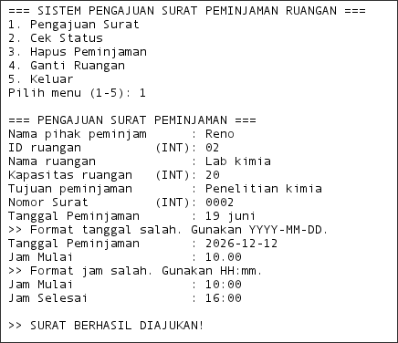
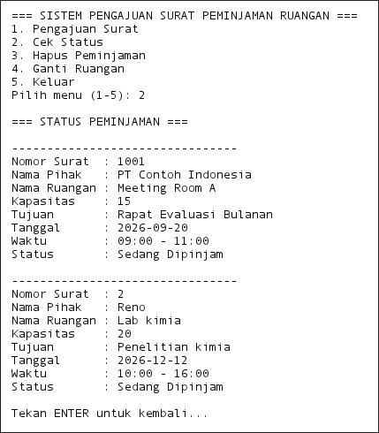
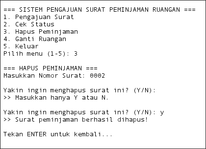
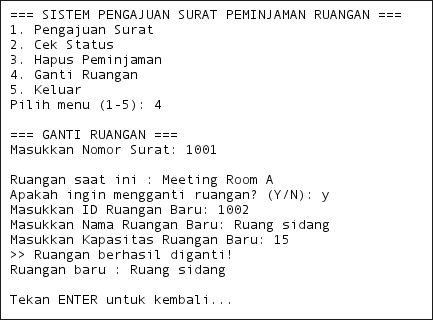
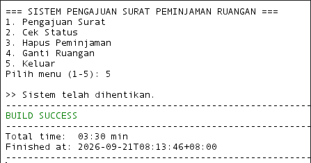

# 2509116040_Sistem-peminjaman-ruangan


## Antonio-marc-laureno-silaban_2509116040

Sistem ini mengandung program yang merepresentasikan proses pengajuan surat untuk meminjam suatu ruangan dengan point of view dari administrator yang mengurus peminjaman ruangan tersebut.

## 1. Hierarki Class

Program Sistem Peminjaman Ruangan memiliki beberapa class yang saling berhubungan untuk mengatur data ruangan, jadwal, dan peminjaman. Class `Ruangan` berperan sebagai **superclass** yang menjadi dasar bagi beberapa jenis ruangan, sedangkan `Laboratorium` dan `MeetingRoom` berperan sebagai **subclass** yang mewarisi atribut dan method dari `Ruangan`.

Hierarki class pada program dapat digambarkan sebagai berikut:

```text
                         Ruangan
                            ▲
                            │
                 ┌──────────┴──────────┐
                 │                     │
          Laboratorium             MeetingRoom
```

Selain hubungan inheritance tersebut, class `Peminjaman` memiliki hubungan dengan `Ruangan` dan `Jadwal`. Sebuah objek `Peminjaman` menyimpan informasi pihak yang meminjam, tujuan peminjaman, nomor surat, ruangan yang digunakan, dan jadwal peminjaman.

Class `Services` digunakan untuk menangani proses utama program seperti pengajuan surat, menampilkan status peminjaman, menghapus peminjaman, mengganti ruangan, serta melakukan validasi input. Sementara itu, class `Peminjamanruangan` berfungsi sebagai class utama yang menjalankan program dan menampilkan menu kepada pengguna.

Struktur hubungan class secara keseluruhan dapat digambarkan sebagai berikut:

```text
Peminjamanruangan
        │
        ▼
    Services
        │
        ▼
   Peminjaman
      /   \
     ▼     ▼
Ruangan   Jadwal
   ▲
   │
┌──┴──────────────┐
│                 │
Laboratorium   MeetingRoom
```

Dengan struktur tersebut, setiap class memiliki tanggung jawab yang berbeda. `Peminjamanruangan` menangani jalannya program, `Services` menangani proses bisnis, `Peminjaman` menyimpan data peminjaman, `Ruangan` menyimpan data dasar ruangan, `Jadwal` menyimpan waktu peminjaman, sedangkan `Laboratorium` dan `MeetingRoom` menyediakan jenis ruangan yang lebih spesifik.

## 2. Penerapan Inheritance

Inheritance diterapkan dengan membuat class `Laboratorium` dan `MeetingRoom` sebagai subclass dari class `Ruangan`. Penerapan tersebut terlihat pada deklarasi class berikut:

```java
public class Laboratorium extends Ruangan {
```

dan:

```java
public class MeetingRoom extends Ruangan {
```

Kata kunci `extends` menunjukkan bahwa `Laboratorium` dan `MeetingRoom` mewarisi anggota dari class `Ruangan`.

Atribut dasar seperti `idRuangan`, `namaRuangan`, `kapasitas`, dan `tersedia` didefinisikan pada class `Ruangan`. Karena atribut tersebut bersifat `private`, subclass tidak mengaksesnya secara langsung. Subclass menggunakan constructor superclass melalui kata kunci `super()`.

Contohnya pada class `Laboratorium`:

```java
public Laboratorium(
        int idRuangan,
        String namaRuangan,
        int kapasitas,
        boolean tersedia,
        String jenisLaboratorium) {

    super(
            idRuangan,
            namaRuangan,
            kapasitas,
            tersedia
    );

    this.jenisLaboratorium = jenisLaboratorium;
}
```

Bagian:

```java
super(
    idRuangan,
    namaRuangan,
    kapasitas,
    tersedia
);
```

digunakan untuk memanggil constructor dari class `Ruangan`. Dengan demikian, data dasar sebuah ruangan tidak perlu dibuat ulang pada class `Laboratorium`.

Class `Laboratorium` kemudian menambahkan atribut khusus yang hanya dimiliki oleh laboratorium:

```java
private String jenisLaboratorium;
```

Sedangkan `MeetingRoom` menambahkan atribut khusus:

```java
private String fasilitas;
```

Dengan demikian, inheritance memungkinkan kedua subclass menggunakan struktur dasar dari `Ruangan`, sekaligus memiliki data tambahan sesuai dengan jenis ruangannya.

Contoh penerapannya pada program adalah:

```java
MeetingRoom meetingRoom = new MeetingRoom(
        201,
        "Meeting Room A",
        15,
        false,
        "Proyektor dan Smart TV"
);
```

Objek `meetingRoom` memiliki data dasar yang diwariskan dari `Ruangan`, yaitu ID ruangan, nama ruangan, kapasitas, dan status ketersediaan. Selain itu, objek tersebut memiliki data khusus `MeetingRoom`, yaitu fasilitas.

Inheritance pada program ini membuat struktur class lebih terorganisasi karena informasi yang sama untuk berbagai jenis ruangan cukup didefinisikan satu kali pada superclass `Ruangan`, sedangkan setiap subclass dapat menambahkan karakteristik khususnya masing-masing.


## Dokumentasi Hasil Pengujian Program

Berikut merupakan dokumentasi hasil pengujian dari **Sistem Peminjaman Ruangan** melalui terminal. Setiap case menunjukkan fungsi utama yang tersedia pada menu program, mulai dari pengajuan peminjaman, pengecekan status, penghapusan peminjaman, penggantian ruangan, hingga keluar dari sistem.

### Case 1 — Pengajuan Surat Peminjaman

Pada Case 1, pengguna memilih menu **Pengajuan Surat Peminjaman** untuk membuat data peminjaman ruangan baru. Pengguna diminta memasukkan beberapa informasi seperti nama pihak, ID ruangan, nama ruangan, kapasitas ruangan, tujuan peminjaman, nomor surat, tanggal peminjaman, serta jam mulai dan jam selesai.

Program juga melakukan validasi terhadap input yang diberikan. Pada pengujian ini, ketika pengguna memasukkan format tanggal yang tidak sesuai, program menampilkan pesan `Format tanggal salah. Gunakan YYYY-MM-DD.`. Hal yang sama terjadi ketika format jam tidak sesuai, sehingga program meminta pengguna memasukkan kembali data dengan format `HH:mm`.

Setelah seluruh data dimasukkan dengan format yang benar, program menampilkan pesan **`SURAT BERHASIL DIAJUKAN!`** sebagai tanda bahwa data peminjaman berhasil ditambahkan ke dalam sistem.



### Case 2 — Cek Status Peminjaman

Pada Case 2, pengguna memilih menu **Cek Status** untuk melihat seluruh data peminjaman yang tersimpan di dalam sistem. Program menampilkan informasi setiap peminjaman, meliputi nomor surat, nama pihak, nama ruangan, kapasitas, tujuan peminjaman, tanggal, waktu, dan status ruangan.

Berdasarkan hasil pengujian, terdapat data peminjaman dengan nomor surat **1001** yang menggunakan **Meeting Room A** untuk kegiatan **Rapat Evaluasi Bulanan**. Selain itu, data peminjaman yang sebelumnya ditambahkan pada Case 1 juga ditampilkan, yaitu peminjaman dengan nomor surat **2** untuk ruangan **Lab kimia** dengan tujuan **Penelitian kimia**.

Case ini menunjukkan bahwa data yang telah dimasukkan melalui proses pengajuan berhasil tersimpan dan dapat ditampilkan kembali oleh sistem.



### Case 3 — Hapus Peminjaman

Pada Case 3, pengguna memilih menu **Hapus Peminjaman** untuk menghapus data peminjaman berdasarkan nomor surat. Program meminta pengguna memasukkan nomor surat yang ingin dihapus, kemudian meminta konfirmasi untuk memastikan bahwa pengguna benar-benar ingin menghapus data tersebut.

Pada pengujian, pengguna memasukkan nomor surat **0002** dan memberikan konfirmasi **Y**. Program kemudian menampilkan pesan **`Surat peminjaman berhasil dihapus!`**, yang menunjukkan bahwa data peminjaman berhasil dihapus dari daftar peminjaman.

Proses konfirmasi ini digunakan agar data tidak langsung terhapus hanya karena pengguna salah memasukkan nomor surat atau memilih menu penghapusan secara tidak sengaja.



### Case 4 — Ganti Ruangan

Pada Case 4, pengguna memilih menu **Ganti Ruangan** untuk mengganti ruangan yang digunakan pada suatu peminjaman. Program terlebih dahulu meminta nomor surat peminjaman yang ingin diubah dan menampilkan nama ruangan yang sedang digunakan.

Pada pengujian ini, nomor surat **1001** sebelumnya menggunakan **Meeting Room A**. Pengguna memilih untuk mengganti ruangan dan kemudian memasukkan data ruangan baru berupa ID ruangan **1002**, nama ruangan **Ruang sidang**, serta kapasitas **15**.

Setelah data berhasil diproses, program menampilkan pesan **`Ruangan berhasil diganti!`** dan menampilkan nama ruangan baru, yaitu **Ruang sidang**. Hal ini menunjukkan bahwa data ruangan pada peminjaman berhasil diperbarui.



### Case 5 — Keluar dari Sistem

Pada Case 5, pengguna memilih menu **Keluar** untuk menghentikan program. Setelah pilihan menu **5** dimasukkan, program menampilkan pesan **`>> Sistem telah dihentikan.`**

Pesan tersebut menunjukkan bahwa proses program telah selesai dan pengguna telah keluar dari sistem dengan normal. Setelah program berhenti, NetBeans juga menampilkan status **`BUILD SUCCESS`**, yang menunjukkan bahwa program berhasil dijalankan tanpa kegagalan build.


